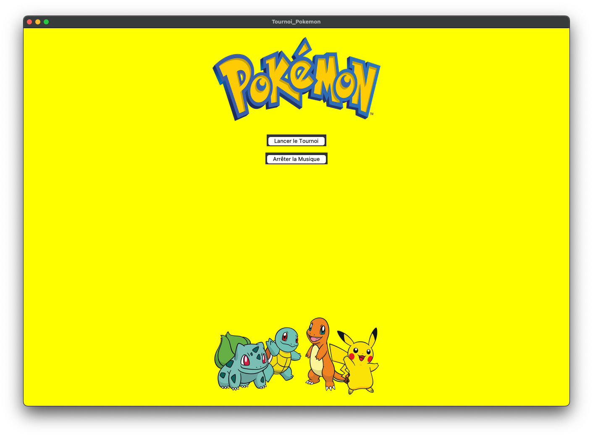
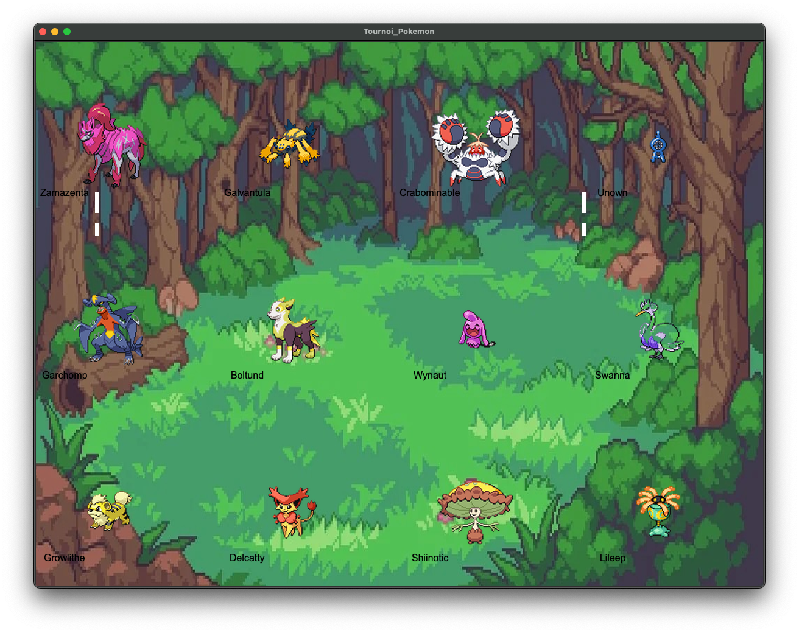

Voici une version adaptée de votre README pour inclure les instructions Docker :

---

# Pokémon Tournament Game

## Description

Le **Pokémon Tournament Game** est un projet en Python utilisant **Tkinter** et **Pygame** pour créer une interface interactive de tournoi Pokémon. Le projet utilise l'API **PokéAPI** pour récupérer les informations sur les Pokémon et propose un tournoi où les Pokémon s'affrontent avec leurs statistiques.

### Fonctionnalités principales :

- Chargement aléatoire de 16 Pokémon depuis l'API **PokéAPI**
- Affichage des 16 participants avant le début du tournoi
- Simulations de combats basés sur les statistiques de chaque Pokémon
- Musique de fond intégrée avec la possibilité de l'activer ou de la désactiver
- Affichage du grand gagnant à la fin du tournoi

## Installation Locale

1. **Clonez le dépôt** :

   ```bash
   git clone https://github.com/votre-utilisateur/pokemon-tournament-game.git
   ```

2. **Accédez au répertoire du projet** :

   ```bash
   cd pokemon-tournament-game
   ```

3. **Créez et activez un environnement virtuel** :

   ```bash
   python3 -m venv .venv
   source .venv/bin/activate  # Sous Windows: .venv\Scripts\activate
   ```

4. **Installez les dépendances** :

   ```bash
   pip install -r requirements.txt
   ```

5. **Lancez le jeu** :
   ```bash
   python app.py
   ```

## Utilisation avec Docker

### Prérequis

- **Docker** : Assurez-vous que Docker est installé et configuré sur votre machine.

### Instructions Docker

1. **Construction de l'image Docker** :

   Depuis le répertoire du projet, construisez l'image Docker :

   ```bash
   docker build -t pokemon_tournament .
   ```

2. **Lancement du conteneur Docker** :

   Une fois l'image construite, lancez le conteneur :

   ```bash
   docker run -it --rm pokemon_tournament
   ```

   **Remarque** : Docker ne prend pas en charge les interfaces graphiques directement, donc l'interface tkinter ne sera pas visible dans un conteneur Docker sans configuration avancée (par ex. X11 pour rediriger la sortie graphique). Pour une utilisation textuelle ou des tests en console, Docker fonctionnera sans interface graphique.

3. **Sortie Audio avec Docker** :

   Si vous souhaitez que la musique fonctionne dans Docker, vous pouvez configurer le conteneur pour rediriger l’audio via PulseAudio (voir la documentation Docker pour configurer les périphériques audio dans un conteneur).

## Interface Utilisateur

### Écran d'accueil

L'écran d'accueil affiche le logo de Pokémon et permet de lancer le tournoi.



### Affichage des 16 Participants

Avant le tournoi, les 16 participants sont affichés avec leurs images et noms récupérés depuis l'API PokéAPI.



### Combat entre deux Pokémon

L'interface montre les Pokémon en combat avec leurs noms et une zone de texte détaillant le déroulement des attaques.


## Utilisation

- **Bouton "Lancer le tournoi"** : Lance le tournoi, affiche les participants et démarre les combats.
- **Bouton "Arrêter la musique"** : Permet de stopper la musique de fond.
- **Affichage des combats** : Pendant les combats, une zone de texte détaille chaque action des Pokémon jusqu'à la victoire.
- **Affichage du gagnant** : À la fin du tournoi, le Pokémon gagnant est affiché en grand.

## Technologies Utilisées

- **Python** : Langage de programmation principal
- **Tkinter** : Pour l'interface graphique
- **Pygame** : Pour la gestion de la musique
- **Pillow** : Pour le traitement des images
- **Requests** : Pour interagir avec l'API PokéAPI
- **Docker** : Pour exécuter le projet dans un environnement isolé

## Contributions

Les contributions sont les bienvenues ! N'hésitez pas à soumettre des issues ou des pull requests.

## Licence

Ce projet est sous licence MIT.

---

Ce README explique comment installer et exécuter le projet à la fois en local et dans un environnement Docker.
